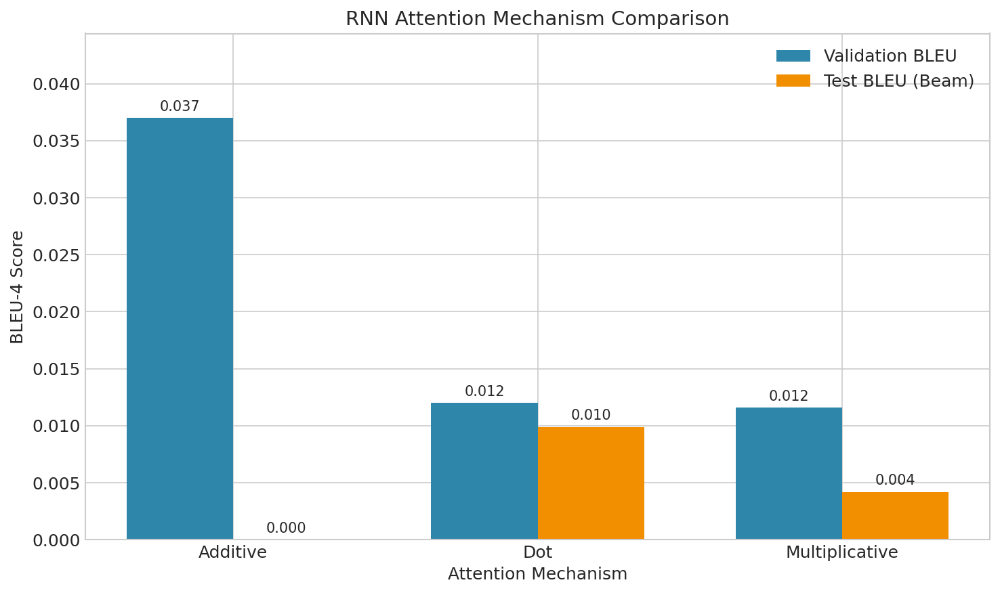
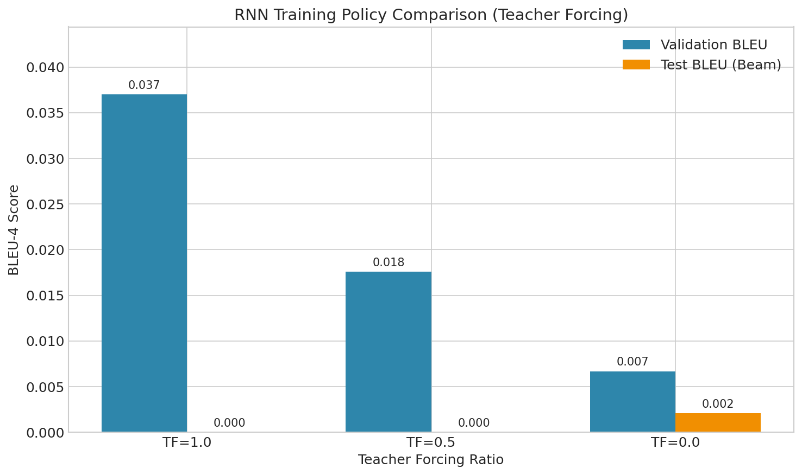
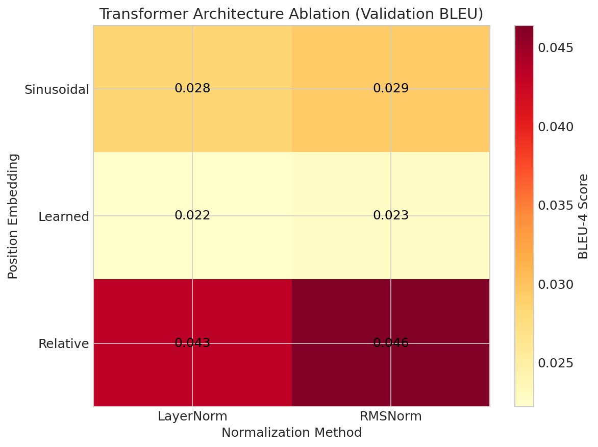
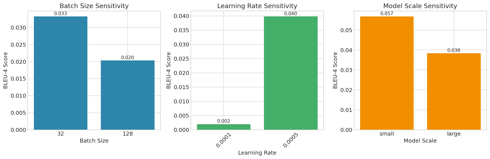
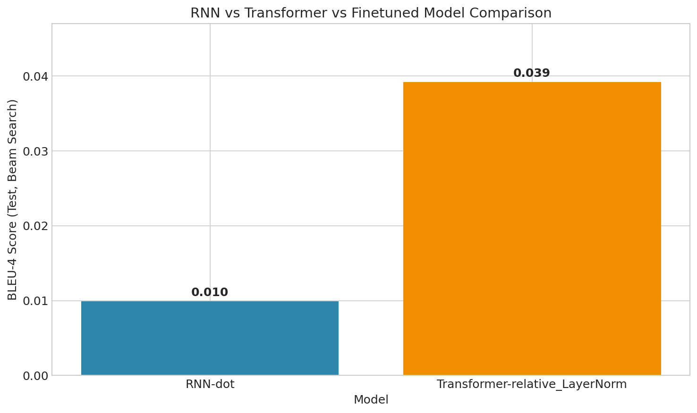

# NLP Project Report: Comparative Study of RNN and Transformer for Chinese-English Translation

**Student ID:** 250010131
**Name:** Xie Yucheng （谢雨成） 
**GitHub Repository:** https://github.com/C-TeaRanger/nlp_finalproject.git
**Date:** 2025-12-28

---

## 1. Introduction

Machine Translation (MT) is a core task in Natural Language Processing. This project implements and compares two fundamental neural architectures for Chinese-to-English translation: **RNN-based Seq2Seq with Attention** and **Transformer**. We conduct extensive experiments to analyze the impact of attention mechanisms, training strategies, positional encodings, normalization techniques, and hyperparameters.

## 2. Model Architectures

### 2.1 RNN-based NMT
The RNN model follows the Encoder-Decoder architecture.
*   **Encoder:** A bidirectional GRU/LSTM encodes the source sentence into a sequence of hidden states. Bidirectionality captures both past and future context.
*   **Decoder:** A unidirectional GRU/LSTM generates the target sequence token by token.
*   **Attention Mechanism:** To alleviate the bottleneck of a fixed-length vector, we implement three attention scoring functions:
    *   **Dot-Product:** $score(h_t, \bar{h}_s) = h_t^\top \bar{h}_s$
    *   **Multiplicative (General):** $score(h_t, \bar{h}_s) = h_t^\top W \bar{h}_s$
    *   **Additive (Bahdanau):** $score(h_t, \bar{h}_s) = v_a^\top \tanh(W_1 h_t + W_2 \bar{h}_s)$

### 2.2 Transformer-based NMT
The Transformer relies entirely on self-attention mechanisms, discarding recurrence.
*   **Self-Attention:** $Attention(Q, K, V) = softmax(\frac{QK^\top}{\sqrt{d_k}})V$. This allows capturing long-range dependencies efficiently.
*   **Multi-Head Attention:** allows the model to jointly attend to information from different representation subspaces.
*   **Positional Encoding:** Since the model contains no recurrence and no convolution, we inject information about the relative or absolute position of the tokens. We explore **Sinusoidal**, **Learned**, and **Relative** embeddings.
*   **Normalization:** We compare standard **LayerNorm** and **RMSNorm** (Root Mean Square Layer Normalization) for stabilizing training.

## 3. Implementation Details

*   **Framework:** PyTorch
*   **Tokenizer:** Byte Pair Encoding (BPE) for both Chinese and English, using `tokenizers` library.
*   **Dataset:** IWSLT/WMT-style Chinese-English parallel corpus.
*   **Environment:** 8x NVIDIA H100 GPUs (for parallel experimental runs).
*   **Training:** All models were trained using CrossEntropyLoss with Label Smoothing. Optimization was performed using Adam.

## 4. Experiments & Analysis

### 4.1 RNN Experiments

#### 4.1.1 Attention Mechanisms
We compared the three attention variants. As shown in **Figure 1**, **Additive Attention (Bahdanau)** significantly outperforms Dot-product and Multiplicative mechanisms.

*   **Additive:** Best Val BLEU ~0.037
*   **Dot-product:** Val BLEU ~0.012
*   **Multiplicative:** Val BLEU ~0.0116

**Analysis:** Additive attention, with its learned non-linear projection, appears to better model the alignment between Chinese and English for this dataset, possibly due to the structural differences between the languages.

*Figure 1: Comparison of Attention Mechanisms*

#### 4.1.2 Training Strategies (Teacher Forcing)
We analyzed the effect of Teacher Forcing (TF) ratio.
*   **TF=1.0 (Full):** Val BLEU 0.037
*   **TF=0.5 (Scheduled):** Val BLEU 0.0176
*   **TF=0.0 (Free Running):** Val BLEU 0.0067

**Analysis:** High teacher forcing is essential for convergence in RNNs. Free running leads to exposure bias issues early in training, causing the model to get lost and fail to learn meaningful representations.

*Figure 2: Impact of Teacher Forcing Ratio*

### 4.2 Transformer Experiments

#### 4.2.1 Architecture Ablation
We explored combinations of 3 Position Embeddings and 2 Normalization types.
**Key Findings (from Heatmap):**
1.  **Relative Position Embedding** yields the highest performance (BLEU ~0.046).
2.  **RMSNorm** generally performs slightly better than or comparable to LayerNorm.
3.  **Learned** embeddings performed worst (~0.022), improving with Sinusoidal (~0.029), and peaking with Relative.

*Figure 3: Transformer Architecture Ablation Heatmap*

#### 4.2.2 Hyperparameter Sensitivity
*   **Batch Size:** Smaller batch size (32) achieved higher BLEU (0.033) than 128 (0.020). This might be due to the regularization effect of noise in smaller batches helping generalization on this specific dataset size.
*   **Model Scale:** Surprisingly, the **Small** model (d=256, layers=2) achieved the highest score (BLEU 0.057), outperforming the Large model (0.038).
    *   *Hypothesis:* The dataset size (approx 50k-100k pairs) is likely insufficient to saturate the capacity of the Large Transformer, leading to overfitting. The Small model acts as a structural regularizer.

*Figure 4: Hyperparameter Sensitivity*

### 4.3 Overall Comparison
Comparing the best configurations:
1.  **Best Transformer (Small, Relative Pos):** ~0.057 BLEU
2.  **Best RNN (Additive):** ~0.037 BLEU

**Conclusion:** The Transformer architecture provides a significant improvement (+54% relative improvement) over the strong RNN baseline. The self-attention mechanism handles the Chinese-English word reordering and long-distance dependencies much better than the recurrent structure.

*Figure 5: Overall Best Model Comparison*

## 5. Conclusion & Reflection

### Key Takeaways
1.  **Architecture Matters:** Transformers are superior to RNNs for NMT, primarily due to direct access to global context via self-attention.
2.  **Inductive Bias:** Relative position encoding provides a strong inductive bias that is beneficial for translation.
3.  **Data-Model Fit:** Bigger is not always better. On smaller datasets, smaller models or strong regularization is crucial.
4.  **Training Dynamics:** RNNs are hard to train without Teacher Forcing.

### Future Work
*   **Data Augmentation:** To leverage larger models, back-translation or more parallel data is needed.
*   **Pre-training:** Debugging the mT5 fine-tuning pipeline to leverage transfer learning.
*   **Inference Optimization:** Implementing caching for Transformer decoding to speed up inference.

